# AWS Serverless Task API

A production-style serverless REST API demonstrating **AWS Lambda, Amazon DynamoDB, API Gateway, Terraform, Jenkins CI/CD, AWS IAM, and Bitbucket**.

The project provisions the AWS infrastructure using Terraform and uses Jenkins to automatically test, package, validate, plan, and deploy changes whenever code is pushed to the Bitbucket repository.

---

## Architecture

```text
                         Developer
                             |
                             | git push
                             v
                      +--------------+
                      |   Bitbucket  |
                      +------+-------+
                             |
                             | Webhook
                             v
                      +--------------+
                      |    Jenkins   |
                      |     CI/CD    |
                      +------+-------+
                             |
              +--------------+--------------+
              |                             |
              v                             v
       Python Unit Tests              Terraform
                                      Init / Validate
                                      Plan / Apply
                                            |
                                            v
                                  +-------------------+
                                  |       AWS         |
                                  |                   |
                                  |  API Gateway      |
                                  |       |           |
                                  |       v           |
                                  |     Lambda        |
                                  |       |           |
                                  |       v           |
                                  |   DynamoDB        |
                                  +-------------------+
```

---

# Technologies Used

| Technology         | Purpose                                  |
| ------------------ | ---------------------------------------- |
| AWS Lambda         | Serverless application execution         |
| Amazon API Gateway | HTTP API and API endpoints               |
| Amazon DynamoDB    | NoSQL database for task data             |
| AWS IAM            | Identity and access management           |
| Amazon S3          | Remote Terraform state storage           |
| Terraform          | Infrastructure as Code                   |
| Jenkins            | CI/CD automation                         |
| Bitbucket          | Source code repository                   |
| Python             | Application and test code                |
| Pytest             | Unit testing                             |
| Boto3              | AWS SDK for Python                       |
| AWS CLI            | AWS resource verification and management |
| Git                | Source code management                   |

---

# Application Features

The API provides CRUD operations for tasks.

| Method | Endpoint           | Description         |
| ------ | ------------------ | ------------------- |
| GET    | `/tasks`           | Get all tasks       |
| POST   | `/tasks`           | Create a task       |
| GET    | `/tasks/{task_id}` | Get a specific task |
| PUT    | `/tasks/{task_id}` | Update a task       |
| DELETE | `/tasks/{task_id}` | Delete a task       |

---

# Project Structure

```text
aws-serverless-task-api/
│
├── function/
│   ├── __init__.py
│   ├── database.py
│   └── handler.py
│
├── tests/
│   └── test_handler.py
│
├── terraform/
│   ├── main.tf
│   ├── variables.tf
│   ├── outputs.tf
│   ├── versions.tf
│   └── .terraform.lock.hcl
│
├── terraform-bootstrap/
│   ├── main.tf
│   └── .terraform.lock.hcl
│
├── screenshots/
│   ├── 01-jenkins-pipeline-successfull.png
│   ├── 02-jenkins-auto-trigger.png
│   ├── 03-terraform-plan-1.png
│   ├── 03-terraform-plan-2.png
│   ├── 04-terraform-apply.png
│   ├── 05-aws-lambda.png
│   ├── 06-aws-lambda-2.png
│   ├── 06-api-gateway-1.png
│   ├── 07-dynamodb-1.png
│   ├── 07-dynamodb-2.png
│   ├── 08-bitbucket-webhook.png
│   └── 09-terminal-api-verification.png
│
├── Jenkinsfile
├── pytest.ini
├── lambda.zip
└── README.md
```

---

# AWS Infrastructure

Terraform provisions the following AWS resources:

* Amazon DynamoDB table
* IAM role for Lambda
* IAM policy for DynamoDB access
* AWS Lambda function
* API Gateway HTTP API
* API Gateway Lambda integration
* API Gateway route
* API Gateway `$default` stage
* Lambda permission for API Gateway
* CloudWatch logging permissions

---

# Terraform Infrastructure as Code

Terraform is used to provision and manage the AWS infrastructure.

The project uses an Amazon S3 backend for remote Terraform state management.

```hcl
terraform {
  backend "s3" {
    bucket = "aws-serverless-task-api-tfstate-2026"
    key    = "aws-serverless-task-api/dev/terraform.tfstate"
    region = "ap-south-1"
  }
}
```

The Terraform bootstrap configuration is responsible for creating the S3 bucket used for remote state.

The state bucket uses:

* S3 Versioning
* Server-side encryption
* Public access blocking
* Remote Terraform state storage

---

# Terraform Plan

Before applying infrastructure changes, Jenkins runs `terraform plan`.

Terraform compares the desired infrastructure configuration with the current AWS resources and generates an execution plan.

### Terraform Plan — Part 1

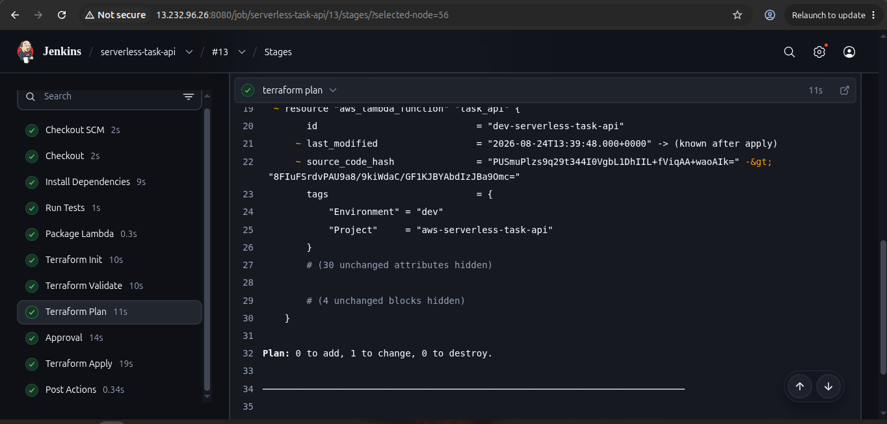

### Terraform Plan — Part 2

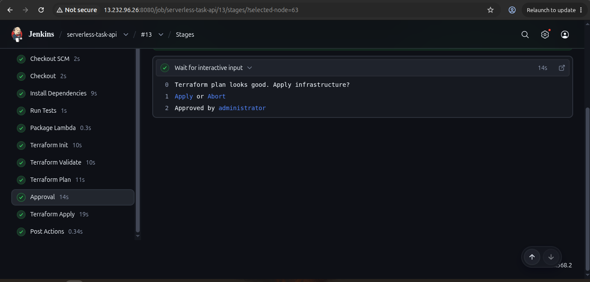

---

# Terraform Apply

After the Terraform plan is reviewed and approved, Jenkins executes `terraform apply`.

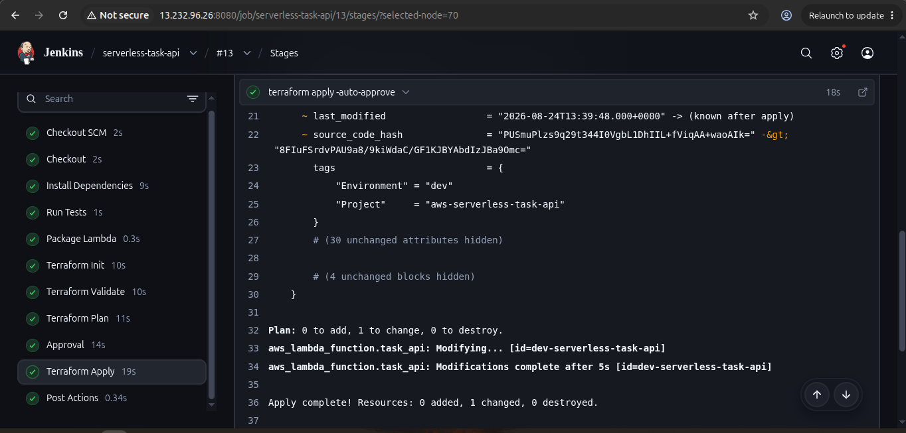

---

# AWS Lambda

The application runs as a Python-based AWS Lambda function.

Lambda receives requests from API Gateway and performs CRUD operations against DynamoDB through Boto3.

The Lambda function supports:

```text
GET     /tasks
POST    /tasks
GET     /tasks/{task_id}
PUT     /tasks/{task_id}
DELETE  /tasks/{task_id}
```

### Lambda Function

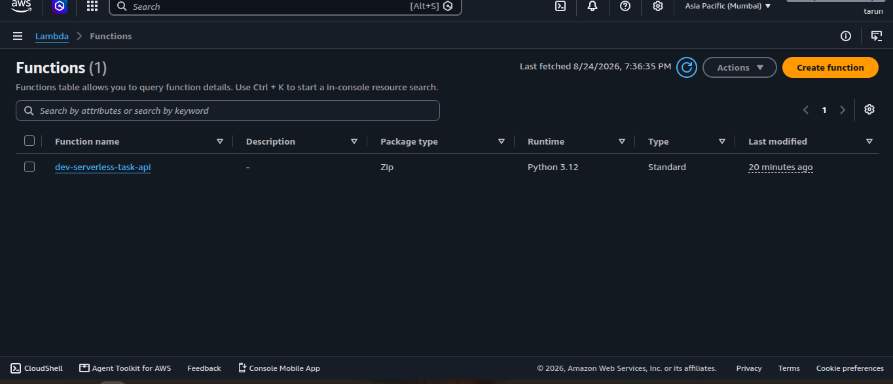

### Lambda Configuration / Details

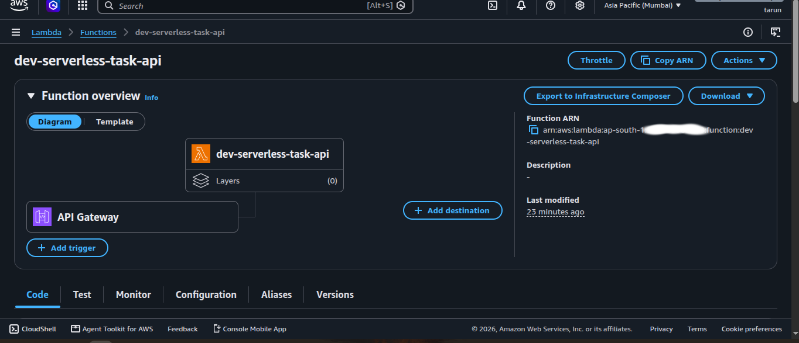

---

# Amazon API Gateway

Amazon API Gateway provides the HTTP endpoint used to access the Lambda function.

The project uses an **API Gateway HTTP API** with Lambda proxy integration.

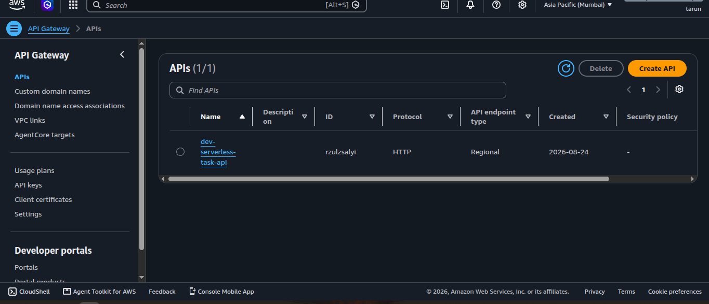

---

# Amazon DynamoDB

Amazon DynamoDB is used as the persistent NoSQL data store for the application.

### DynamoDB Table

```text
aws-serverless-task-api-dev
```

### Partition Key

```text
task_id
```

### Billing Mode

```text
PAY_PER_REQUEST
```

### Example Item

```json
{
  "task_id": "task-001",
  "title": "Configure AWS infrastructure",
  "description": "Provision DynamoDB, Lambda and API Gateway using Terraform",
  "status": "completed"
}
```

### DynamoDB Table

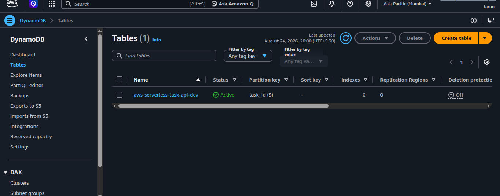

### DynamoDB Items

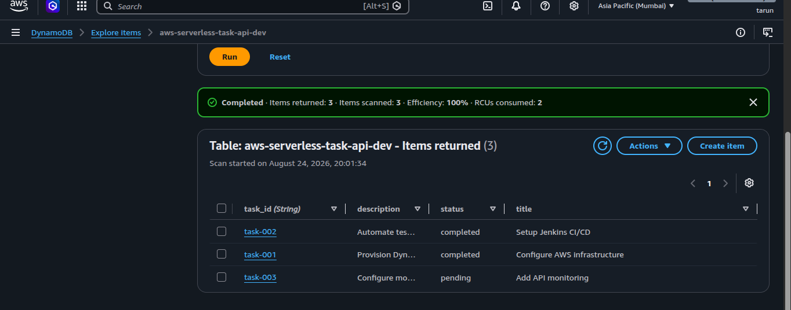

---

# Jenkins CI/CD Pipeline

Jenkins automates the application testing, Lambda packaging, Terraform validation, infrastructure planning, approval, and deployment process.

The pipeline follows this workflow:

```text
Bitbucket Push
      |
      v
Jenkins Webhook
      |
      v
Checkout Source Code
      |
      v
Create Python Virtual Environment
      |
      v
Install Dependencies
      |
      v
Run Tests
      |
      v
Package Lambda
      |
      v
Terraform Init
      |
      v
Terraform Validate
      |
      v
Terraform Plan
      |
      v
Manual Approval
      |
      v
Terraform Apply
      |
      v
AWS Deployment
```

---

# Successful Jenkins Pipeline

The Jenkins pipeline successfully executes the complete CI/CD workflow.

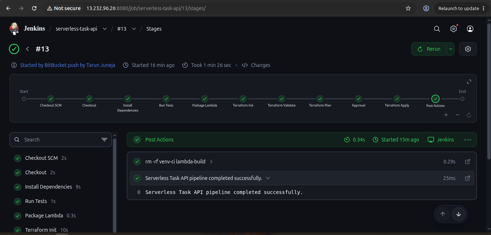

---

# Automatic Jenkins Build Trigger

A Bitbucket webhook automatically triggers the Jenkins pipeline whenever changes are pushed to the repository.

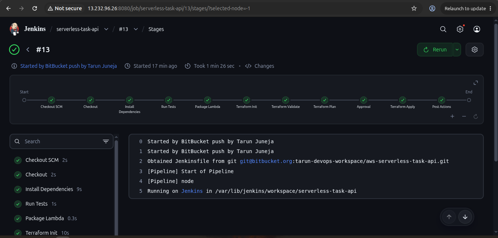

---

# Bitbucket Webhook

Bitbucket is configured with a webhook that communicates with Jenkins.

This enables automatic CI/CD execution when a new change is pushed to the repository.

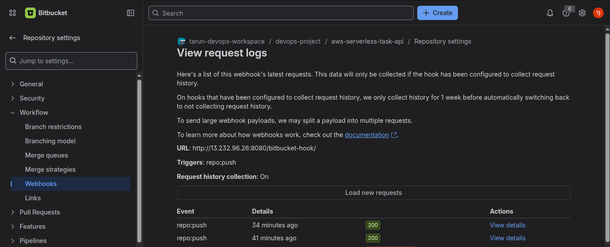

---

# CI/CD Pipeline Stages

## 1. Checkout

Jenkins checks out the latest source code from Bitbucket using SSH authentication.

## 2. Install Dependencies

Jenkins creates a Python virtual environment and installs the required dependencies.

## 3. Run Tests

Pytest executes the automated test suite.

## 4. Package Lambda

The Lambda application is packaged into:

```text
lambda.zip
```

## 5. Terraform Init

Terraform initializes the AWS provider and the remote S3 backend.

## 6. Terraform Validate

Terraform validates the infrastructure configuration.

## 7. Terraform Plan

Terraform generates an execution plan showing the proposed infrastructure changes.

## 8. Approval

A manual approval step allows the planned infrastructure changes to be reviewed before deployment.

## 9. Terraform Apply

Terraform applies the approved infrastructure changes to AWS.

---

# API Testing and Verification

The deployed API can be verified using the API Gateway endpoint.

Example:

```text
GET /tasks
```

Example response:

```json
{
  "tasks": [
    {
      "task_id": "task-001",
      "title": "Configure AWS infrastructure",
      "description": "Provision DynamoDB, Lambda and API Gateway using Terraform",
      "status": "completed"
    }
  ],
  "source": "Jenkins CI/CD"
}
```

### Terminal API Verification

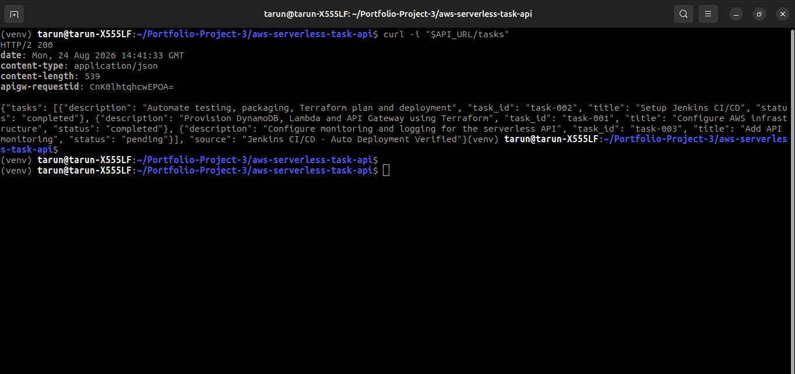

---

# Example API Requests

## Create a Task

```bash
curl -X POST "<API_URL>/tasks" \
  -H "Content-Type: application/json" \
  -d '{
    "title": "Configure monitoring",
    "description": "Configure monitoring for the serverless application",
    "status": "pending"
  }'
```

## Get All Tasks

```bash
curl "<API_URL>/tasks"
```

## Get a Specific Task

```bash
curl "<API_URL>/tasks/task-001"
```

## Update a Task

```bash
curl -X PUT "<API_URL>/tasks/task-001" \
  -H "Content-Type: application/json" \
  -d '{
    "status": "completed"
  }'
```

## Delete a Task

```bash
curl -X DELETE "<API_URL>/tasks/task-001"
```

---

# Testing

The project uses **Pytest** for automated testing.

Run the tests locally:

```bash
pytest -v
```

The Jenkins pipeline executes the test suite before proceeding with the infrastructure deployment.

---

# Security

The project follows several AWS security practices:

* Terraform state is stored remotely in Amazon S3.
* S3 public access is blocked.
* S3 state bucket uses server-side encryption.
* S3 bucket versioning is enabled.
* Lambda uses a dedicated IAM execution role.
* Lambda receives the required DynamoDB permissions for the application.
* Jenkins uses a dedicated IAM role.
* `iam:PassRole` is restricted to the Lambda execution role.
* Bitbucket authentication uses SSH.
* AWS credentials are not stored in the repository.
* Sensitive configuration files are excluded from Git.
* Terraform state files are excluded from Git where appropriate.

---

# Key DevOps Concepts Demonstrated

This project demonstrates practical experience with:

* Infrastructure as Code
* Terraform
* Terraform remote state
* Terraform S3 backend
* AWS IAM
* IAM least-privilege permissions
* AWS Lambda
* Amazon API Gateway
* Amazon DynamoDB
* CloudWatch
* Python
* Boto3
* Pytest
* Jenkins
* CI/CD
* Bitbucket
* Bitbucket webhooks
* Git
* AWS CLI
* Automated infrastructure deployment
* Serverless architecture

---

# Deployment Flow

```text
Developer
    |
    | git push
    v
Bitbucket
    |
    | Webhook
    v
Jenkins
    |
    +--> Checkout
    |
    +--> Install Dependencies
    |
    +--> Run Tests
    |
    +--> Package Lambda
    |
    +--> Terraform Init
    |
    +--> Terraform Validate
    |
    +--> Terraform Plan
    |
    +--> Manual Approval
    |
    +--> Terraform Apply
    |
    v
AWS
    |
    +--> API Gateway
    |
    +--> Lambda
    |
    +--> DynamoDB
```

---

# Project Outcome

This project demonstrates an end-to-end **serverless AWS application deployment using Infrastructure as Code and CI/CD**.

A code change pushed to Bitbucket automatically triggers Jenkins. Jenkins checks out the code, installs dependencies, runs automated tests, packages the Lambda function, initializes and validates Terraform, generates a Terraform plan, waits for approval, and deploys the approved changes to AWS.

The deployed API communicates with Lambda, which performs CRUD operations against DynamoDB.

---

# Future Improvements

Potential improvements include:

* Add API authentication using Amazon Cognito or JWT authorizers
* Add CloudWatch alarms
* Add structured application logging
* Add API Gateway throttling
* Add reusable Terraform modules
* Add separate development and production environments
* Add automated security scanning
* Add Terraform formatting and linting stages
* Add test coverage reporting
* Add deployment notifications
* Add rollback strategy
* Add AWS X-Ray tracing

---

# Author

**Tarun Juneja**

Cloud / DevOps Engineer Portfolio Project


